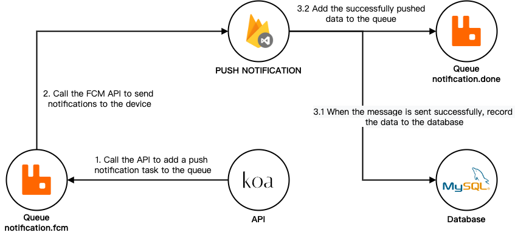

# FCM

A service that is able to deliver push notifications to specific mobile devices.

## How To Configure

1. Copy the file named `example.env` to the root directory.
2. Please set the following environment variables to make the service work properly.
   - Database
      - MYSQL_ROOT_PASSWORD
      - MYSQL_USER
      - MYSQL_PASSWORD
   - FCM API
      - FCM_KEY
   - RabbitMQ
      - RABBITMQ_USER
      - RABBITMQ_PASSWORD

## How To Build

```
docker network create fcm

docker-compose --env-file dev.env up -d
```

## How To Test API

```
curl -XPOST -H "Content-type: application/json" -d '{
   "identifier":"fcm-msg-a1beff5ac",
   "type":"device",
   "deviceId":"string",
   "text":"Notification message"
}' 'http://localhost:3000/api/message/send'
```

## Architecture



## TODOs

- [ ] RABBITMQ_DEFAULT_USER/PASS environment variables not taken into account

###### 標籤: `Node.js` `RabbitMQ` `MySQL` `FCM` `Interview`